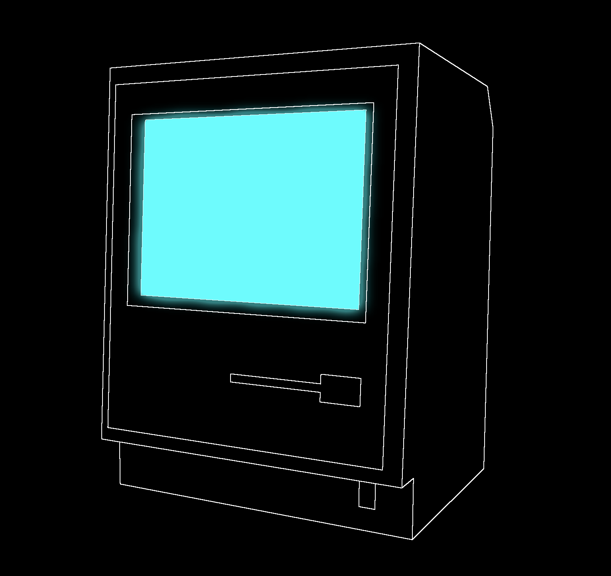

# Experiment

This experiment, I wanted to have the mac with sharp outlines, but the screen a flickering blue with bloom.

I ran into a bevvy of problems getting this done, here are some of the things I tried that **didn't** work.

1. I tried to render the sobel effect and *then* render the screen/color pass. This failed because apparently you can't do a render pass after a shader pass. Seems crazy but I couldn't get it to work. Even render pass 1 -> copyshader pass -> render pass 2, render pass 2 wont actually render. Weird right?
2. I tried to do a mask thing? I can't quite remember. I think there was an issue with masking because the screen is wholly inside the bounds of the mac that I want outlined, so it would get stenciled out too? Honestly I can't remember, too bad.

What ended up working is a combination of more clever masking, and blending two scenes together.
I made a separate scene for masking, that consists just of the scene bezel, that way we're masking the minimum necessary to keep the screen hidden from the top and sides, without dealing with the enormous number of weird artifacts and transparency issues from masking the whole thing. Masking the whole thing didn't work because it blocked blending, stuff like that.

What I'm doing then is mask the screen with the bezel, render it, do the bloom, and save it to a texture. Then in a separate render target, render the body of the mac, run my custom sobel outliner, and then blend it with the output of the screen render texture.

I had to make a custom blend shader to maintain the crisp white outlines, and only blend in stuff from the bloomed screen.