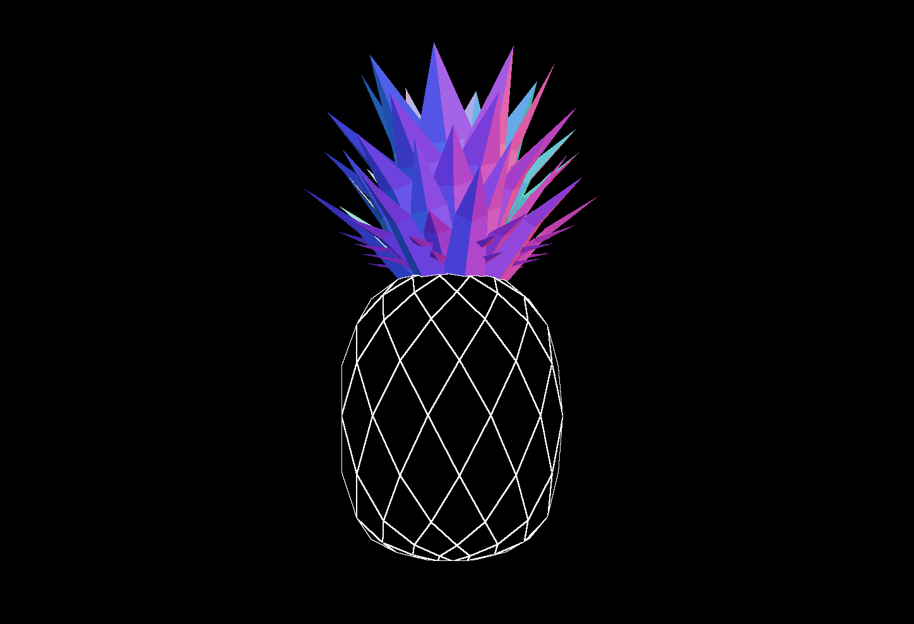

# Experiment

Another outline experiment!  This iteration is very very efficient, no masking involved, and one render pass (not counting the effect pass, etc). It could be a guide to future work on this stuff.